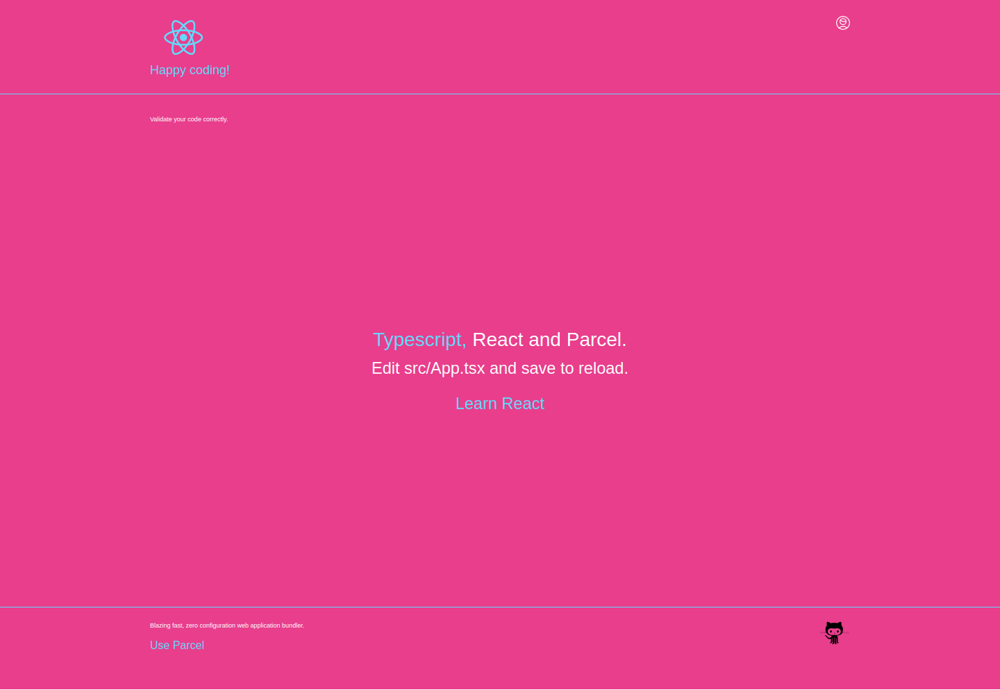

# React,TypeScript, ESLint, Parcel and reactstrap app. 

In the project directory, you can run:

### yarn start

Open [http://localhost:1234](http://localhost:1234) to view it in the browser.

#### .gitignore 

Templates generated by selecting Operating System, IDE, 
and Programming Language.(https://www.toptal.com/developers/gitignore)

### snyk

CLI and build-time tool to find & fix known vulnerabilities in 
open-source dependencies. (https://snyk.io/)

## rimraf

Module used to clean node packages. (https://yarnpkg.com/package/rimraf)

